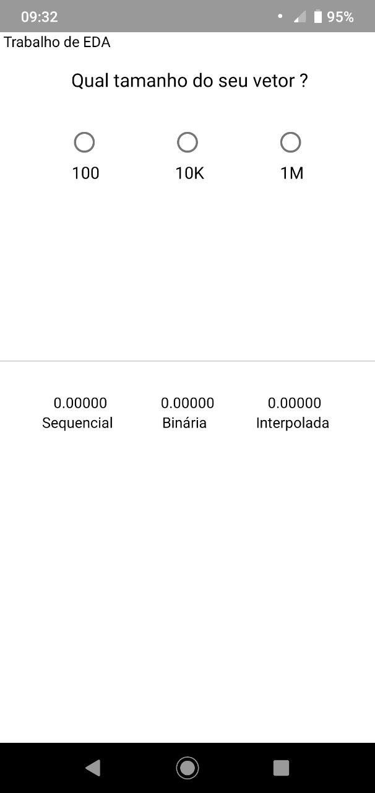
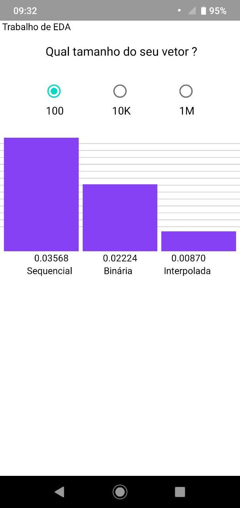
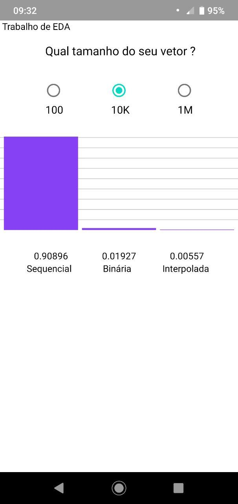
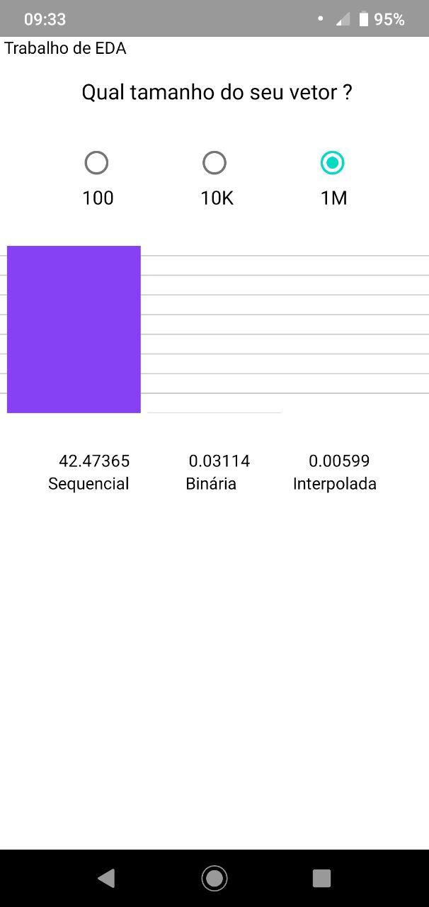

# Lista 1 - Algorítimos de Busca 

## Alunos:
João Lucas Fragoso Zarbiélli - 170146251
Gabriel Filipe Manso Araujo - 160121019

## Sobre:

O trabalho consiste em um app que faz comparação entre três tipos de algorítimos de busca, a busca sequencial, busca binária e busca interpolada, para vetores com tamanhos de 100, 10.000 e 1.000.000 de itens. É gerado um gráfico de barras com o tempo de execução para cada um dos algorítimos.

## Execução: 

Para executar o programa é necessário ter instalado o Expo CLI, para isso execute o seguinte comando no terminal:

      $ npm install -g expo-cli

Após instalado navege até a pasta do app e execute:

       $  expo start 

Baixe o aplicativo Expo no celular e escaneie o QR code gerado no terminal. 

## Prints:

